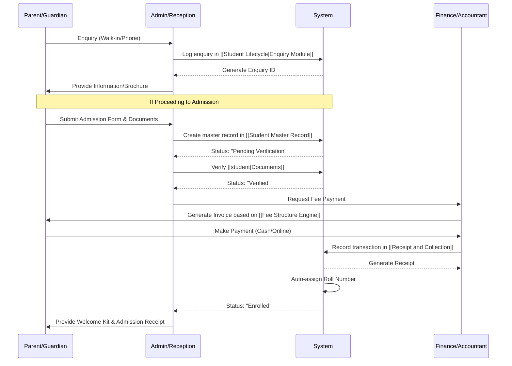

# Admission Flow

This document visualizes the step-by-step process of admitting a new student into CampusSync.

## Related Requirements
- [[Student Lifecycle]]
- [[Student Master Record]]
- [[Receipt and Collection]]

## Related Schemas
- [[student|Student Schema]]
- [[Finance and Fee Schema]]
