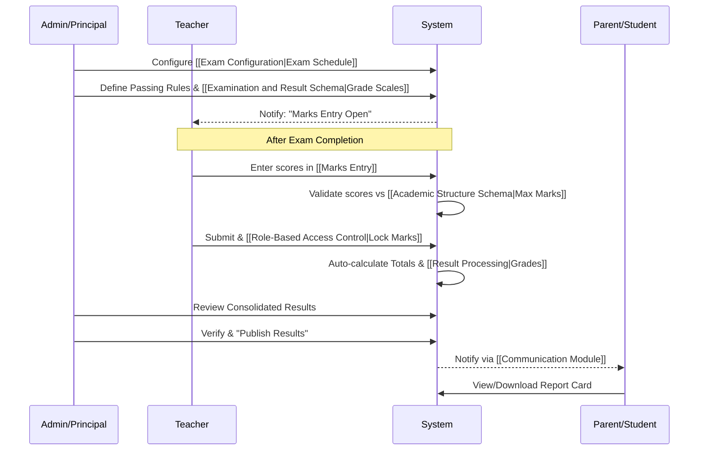

# Examination Cycle

This document outlines the end-to-end process of conducting exams and generating results.

## Related Requirements
- [[Exam Configuration]]
- [[Marks Entry]]
- [[Result Processing]]

## Related Schemas
- [[Examination and Result Schema]]
- [[Academic Structure Schema]]
