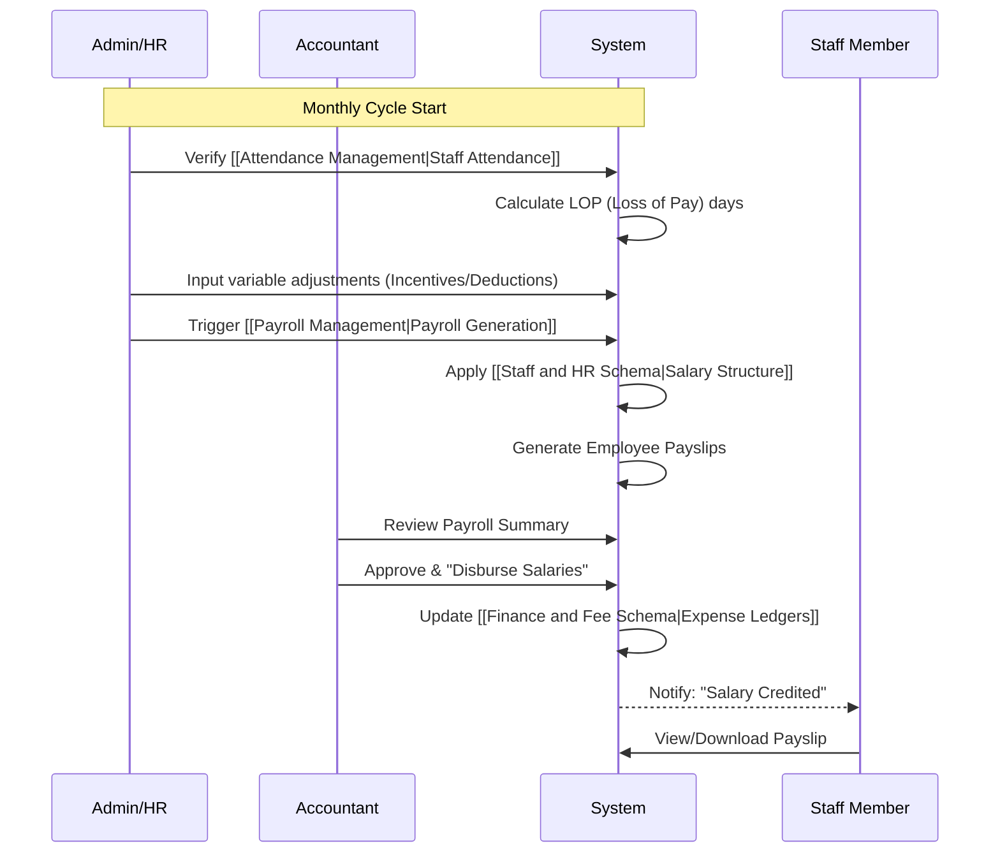

# Payroll Process

This document visualizes the monthly staff compensation lifecycle.

## Related Requirements
- [[Staff Management]]
- [[Payroll Management]]
- [[Attendance Management]]

## Related Schemas
- [[Staff and HR Schema]]
- [[Finance and Fee Schema]]
- [[Attendance Schema]]
