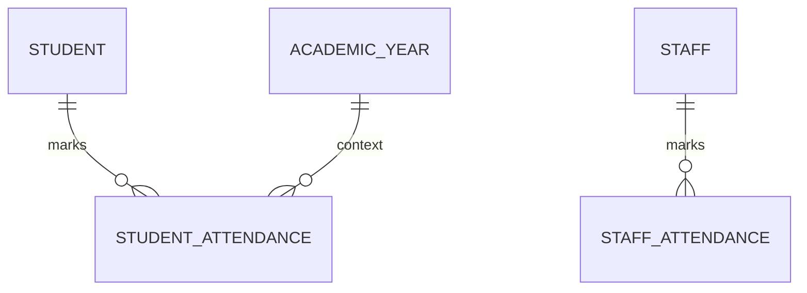

# Attendance Schema

This document provides a high-level index of the **Attendance** domain.

## Atomic Tables
- [[Student Attendance Table]]
- [[Staff Attendance Table]]

---
**Core Documentation**: [[Product Perspective]], [[Data Dictionary]]
**Functional Requirements**: [[Attendance Management]]
