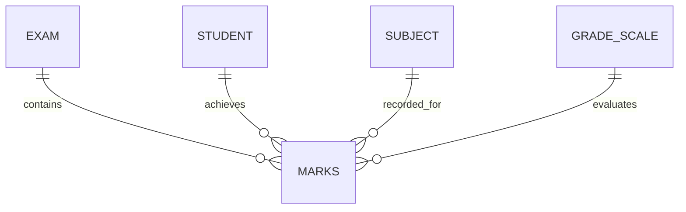

# Examination and Result Schema

This document provides a high-level index of the **Examination and Grading** domain.

# 3. GradeScale
Defines the mapping between percentage ranges and letter grades.

---

# Relations & Obsidian Links
---
**Technical Schema**: [[Data Dictionary]]
**Related Schemas**:
    - [[student|Student Schema]]
    - [[Academic Structure Schema]]
- **Functional Requirements**:
    - [[Exam Configuration]]
    - [[Marks Entry]]
    - [[Result Processing]]

---

# Suggested SQLite Table Structure
`exams`, `marks`, `grade_scales`
