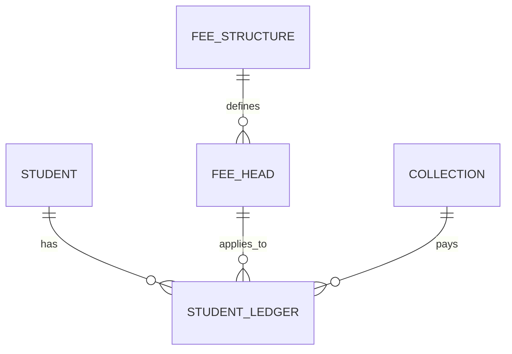

# Finance and Fee Schema

This document provides a high-level index of the **Financial and Fee Management** domain.

## Atomic Tables
- [[Fee Structure Table]]
- [[Fee Head Table]]
- [[Student Ledger Table]]
- [[Fee Collection Table]]

---
**Core Documentation**: [[Product Perspective]], [[Data Dictionary]]
**Functional Requirements**: [[Fee Structure Engine]], [[Student Fee Application]], [[Receipt and Collection]], [[Financial Reporting]]

---

# Suggested SQLite Table Structure
`fee_structures`, `fee_heads`, `student_ledger`, `fee_collections`
