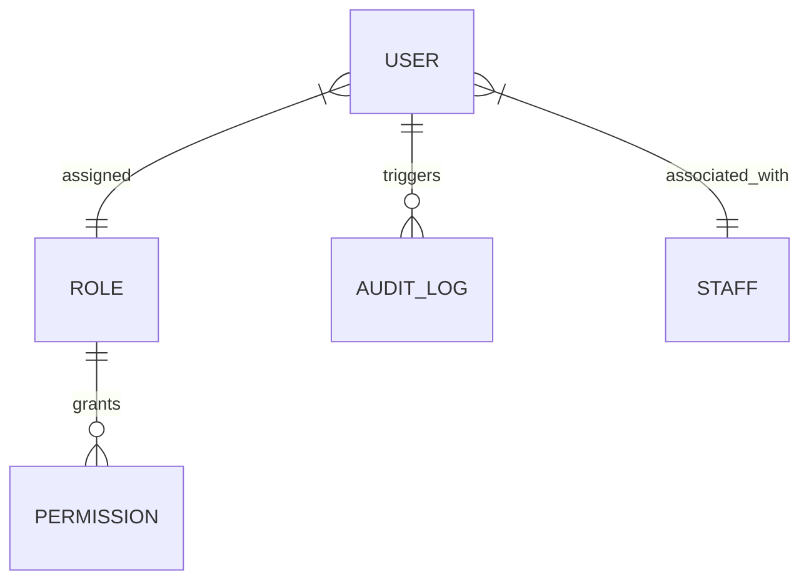

# RBAC and Security Schema

This document provides a high-level index of the **Role-Based Access Control and Security** domain.

## Atomic Tables
- [[User Table]]
- [[Role Table]]
- [[Permission Table]]
- [[Audit Log Table]]

---
**Core Documentation**: [[Product Perspective]], [[Data Dictionary]]
**Functional Requirements**: [[Role-Based Access Control]]
