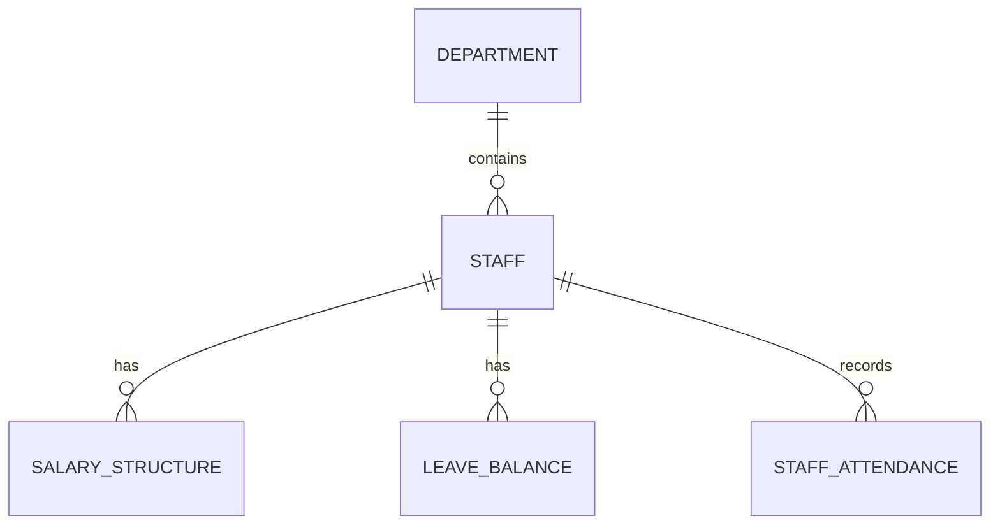

# Staff and HR Schema

This document provides a high-level index of the **Staff and Human Resources** domain.

## Atomic Tables
- [[Staff Table]]
- [[Salary Structure Table]]
- [[Leave Balance Table]]

---
**Core Documentation**: [[Product Perspective]], [[Data Dictionary]]
**Functional Requirements**: [[Staff Management]], [[Payroll Management]], [[Leave Management]]
