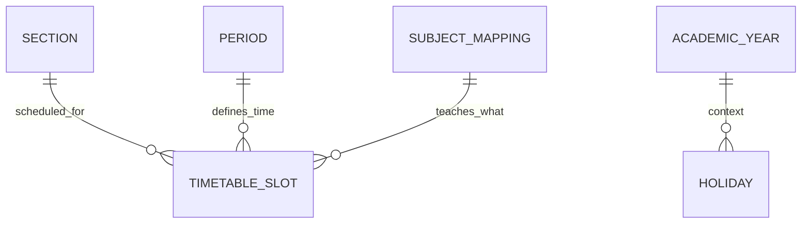

# Timetable Schema

This document provides a high-level index of the **Timetable and Scheduling** domain.

## Atomic Tables
- [[Period Table]]
- [[Timetable Slot Table]]
- [[Holiday Table]]

---
**Core Documentation**: [[Product Perspective]], [[Data Dictionary]]
**Functional Requirements**: [[Timetable Management]]
